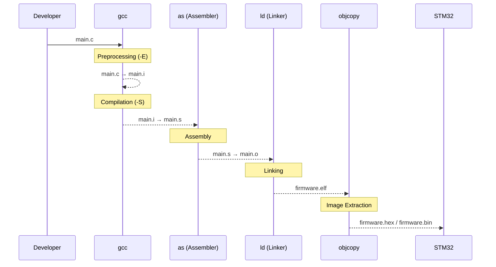
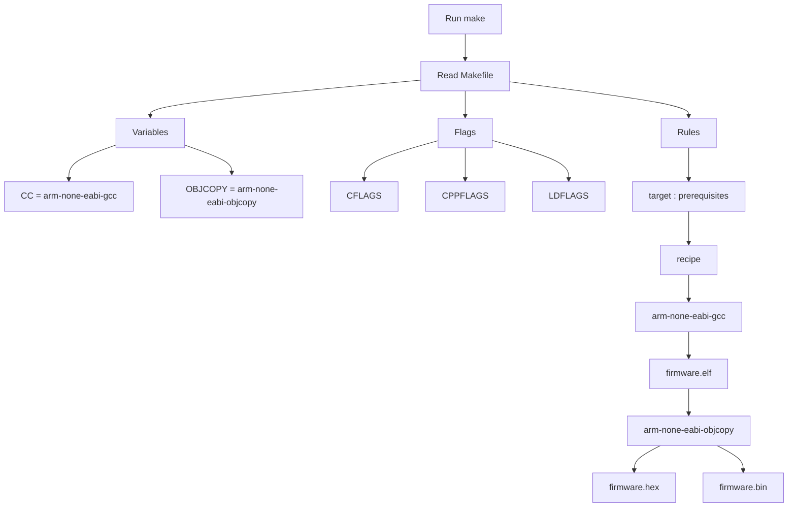

# Ngày 1: Cross-Compilation & GCC ARM Toolchain

## 🎯 Mục tiêu
- Hiểu được khái niệm **Cross-compile** (biên dịch chéo).
- Biết cách sử dụng dòng lệnh thay vì dùng nút bấm đồ họa của IDE.
- Làm quen với cấu trúc `Makefile` cơ bản.

## 📝 Kiến thức cốt lõi
1. **Native Compilation:** Biên dịch code trên PC và chạy luôn trên chip của PC (x86_64).
2. **Cross Compilation:** Biên dịch code trên PC nhưng file đầu ra dùng để chạy dưới vi điều khiển ARM Cortex-M3.
3. 
## 💻 Các câu lệnh đã dùng
Lệnh biên dịch file `main.c` đầu tiên:

 1.Tạo ra file thực thi **ELF**
```bash
+ arm-none-eabi-gcc -c main.c -o main.o (complier&driver)
-> Công cụ giúp biên dịch code C -> hợp ngữ assembly 
+ arm-none-eabi-as (Assembler)
-> Biên dịch file hợp ngữ .s -> file mã nhị phân .o(object file)
+ arm-none-eabi-ld (trình liên kết linker)
-> Gom tất cả các file .o , đọc file linker (.ld) phân vùng ram, flash, 
```
 2.Phân tích file **ELF**
 ```bash
 arm-none-eabi-objdump (Object Dump):
-> Công cụ này cực kỳ bá đạo. Nó có thể "Dịch ngược" (Disassemble) file mã máy .o hoặc .elf của bạn quay trở lại thành file Assembly. Giúp bạn kiểm tra xem code C của mình khi biến thành mã máy thực tế trông như thế nào.

arm-none-eabi-readelf:
-> Giúp bạn đọc cấu trúc chi tiết của file ELF, biết được kích thước của các vùng nhớ như .text (chứa code), .data (chứa biến khởi tạo), .bss (chứa biến chưa khởi tạo) chiếm bao nhiêu byte trên STM32.

arm-none-eabi-nm: 
->Liệt kê danh sách tất cả các Hàm (Functions) và Biến toàn cục (Symbols) có trong chương trình, kèm theo địa chỉ ô nhớ chính xác của chúng trên RAM/Flash.
```
3. Bộ chuyển đổi định dạng (Format converter)
```bash
arm-none-eabi-objcopy: File .elf tạo ra ở trên tuy đầy đủ thông tin nhưng lại chứa cả các dữ liệu dùng để debug (sửa lỗi) nên dung lượng rất nặng và mạch nạp không hiểu được.

 objcopy sẽ nhảy vào bóc tách, vứt hết các thông tin rác thừa thãi đi, chỉ giữ lại mã máy thuần túy để chuyển đổi sang file dạng .bin hoặc .hex. Đây mới là file gọn nhẹ nhất dùng để nạp trực tiếp xuống chip STM32.
``` 



================================================================================
          SỔ TAY TRA CỨU: CÁC CỜ BIÊN DỊCH (COMPILER FLAGS) TRONG GCC ARM
================================================================================

Trong bộ công cụ GCC ARM Toolchain, "Compiler Flags" (Cờ biên dịch) là các tham số 
được gõ kèm sau lệnh nhằm điều khiển hành vi của trình biên dịch, tối ưu hóa bộ 
nhớ hoặc chỉ định cấu hình phần cứng cho chip đích.

--------------------------------------------------------------------------------
1. NHÓM CỜ ĐIỀU KHIỂN GIAI ĐOẠN BIÊN DỊCH (Compilation Stages)
--------------------------------------------------------------------------------
* -E  : (Preprocess Only) Chỉ thực hiện giai đoạn Tiền xử lý. Dừng lại sau khi 
        xử lý các macro (#define, #include) và xuất ra file ".i".
* -S  : (Compile to Assembly) Dịch mã nguồn C sang ngôn ngữ Hợp ngữ (Assembly), 
        xuất ra file ".s".
* -c  : (Compile and Assemble, but do not link) Biên dịch và Hợp dịch mã nguồn 
        thành file mã máy nhị phân cục bộ ".o" (Object file), ngăn không cho 
        trình liên kết (Linker) chạy.
* -o  : (Output) Chỉ định tên và định dạng cho file đầu ra (ví dụ: -o main.o).

--------------------------------------------------------------------------------
2. NHÓM CỜ CHỈ ĐỊNH PHẦN CỨNG CPU (Target Architecture Flags)
--------------------------------------------------------------------------------
* -mcpu=<name> : Chỉ định chính xác tên lõi vi xử lý của chip mục tiêu.
                 Ví dụ: -mcpu=cortex-m3, -mcpu=cortex-m4, -mcpu=cortex-m7.
* -mthumb      : Yêu cầu trình biên dịch dịch code sang tập lệnh "Thumb" (tập lệnh 
                 tối ưu hóa kích thước mã 16-bit của ARM dành cho vi điều khiển), 
                 đây là bắt buộc đối với dòng Cortex-Mx.
* -mfloat-abi=<type> : Cấu hình cách xử lý số thực (FPU). Có 3 chế độ:
          - soft     : Giả lập tính toán số thực bằng phần mềm (mặc định).
          - softfp   : Tính toán bằng phần cứng FPU nhưng truyền tham số bằng thanh ghi thường.
          - hard     : Khai thác tối đa FPU phần cứng, truyền tham số bằng thanh ghi FPU (nhanh nhất).
* -mfpu=<name> : Chỉ định tên bộ tính toán số thực phần cứng (ví dụ: -mfpu=fpv4-sp-d16).

--------------------------------------------------------------------------------
3. NHÓM CỜ TỐI ƯU HÓA CODE (Optimization Flags)
--------------------------------------------------------------------------------
* -O0 : Không tối ưu hóa. Code dịch ra giống y hệt logic viết tay, dễ debug nhất.
* -O1 : Tối ưu hóa cơ bản về dung lượng và tốc độ.
* -O2 : Tối ưu hóa nâng cao về tốc độ chạy của CPU.
* -O3 : Tối ưu hóa cực hạn về tốc độ (có thể làm tăng dung lượng file bin).
* -Os : Tối ưu hóa đặc biệt giúp thu nhỏ dung lượng file mã máy ở mức thấp nhất 
        để vừa vặn với bộ nhớ Flash nhỏ của vi điều khiển.

--------------------------------------------------------------------------------
4. NHÓM CỜ CẢNH BÁO VÀ SỬA LỖI (Warning & Debug Flags)
--------------------------------------------------------------------------------
* -Wall : (Warn All) Bật tất cả các cảnh báo lỗi cú pháp nguy hiểm trong code C.
* -g    : Chèn thêm thông tin Debug (Sửa lỗi) vào file ".elf" để phục vụ cho các 
          mạch nạp debug như ST-Link, J-Link soi lỗi từng dòng code.


## 🛠 4.MAKEFILE
1. Một khối MAKEFILE tiêu chuẩn được  xây dựng theo công thức:
**Khai báo biến** (Variables) -> **Định nghĩa các Cờ** (Flags) -> **Viết quy tắc dịch (Rules)**.
    - `Khối Khai báo biến`:
    ```makefile
        CC      = arm-none-eabi-gcc / CC viết tắt của C-complier
        OBJCOPY = arm-none-eabi-objcopy / OBJCOPY  công cụ bóc tách , chuyển đổi định dạng máy.
    ```
    - `Định nghĩa các cờ`
     ```makefile
        CFLAGS  = -mcpu=cortex-m3 -mthumb -O0 -Wall
        -mcpu cho ta biết ta đang sử dụng <cortex m3>
        -mthumb : Ép sang lệnh mthumb tối ưu cho VDK(bắt buộc với các dòng arm cotex).
        -O0: Giữ nguyên logic code để dễ debug, không tối ưu hóa làm biến đổi cấu trúc câu lệnh.
        -Wall: Bật toàn bộ cảnh báo nếu code C có nguy cơ lỗi cú pháp.
     ```
     - `Quy tắc dịch`
     ```makefile
        Target(dau ra): Dependencies(Đầu vào bắt buộc)
            Command(lệnh cần thực thi)
        **⚠️ CẢNH BÁO TỐI QUAN TRỌNG: Phía trước các câu lệnh Command bắt buộc phải là một phím TAB trên bàn phím**
            💡 Cơ chế hoạt động: Khi bạn gõ make, hệ thống sẽ tự động quét file, thấy chữ $(CC) nó sẽ tự động thay thế bằng arm-none-eabi-gcc.     Thấy chữ $(CFLAGS) nó sẽ tự thế bằng cụm cờ dài phía trên.
     ```

# Dependency trong Makefile

## 1. Dependency là gì?

Dependency (Prerequisite) là **các file mà Target phụ thuộc vào để được tạo ra**.

```make
target : prerequisites
    recipe
```

Ví dụ:

```make
main.o : main.c
    $(CC) -c main.c -o main.o
```

Đọc là:

> Muốn tạo **main.o** thì cần **main.c**.

---

## 2. Mục đích của Dependency

Dependency giúp **Make chỉ build lại những file cần thiết**, thay vì build lại toàn bộ project.

Ví dụ project:
```makefile
main.c
gpio.c
uart.c

↓

main.o
gpio.o
uart.o

↓

firmware.elf

↓

firmware.bin

---
```
## 3. Make quyết định Build như thế nào?

Make so sánh **Timestamp (thời gian chỉnh sửa cuối cùng)**.

Ví dụ:
```makefile
main.c      10:30
main.o      10:01

↓

main.c mới hơn main.o

↓

Compile lại main.o

Nếu:

main.c      10:00
main.o      10:01

↓

main.o đã mới nhất

↓

Không cần compile.

---
```
## 4. Header file cũng là Dependency

Ví dụ:

```c
#include "gpio.h"
```

Makefile:

```make
main.o : main.c gpio.h
```

Nếu:

gpio.h thay đổi

↓

main.o phải compile lại.

---

## 5. Dependency tạo thành chuỗi
```makefile
main.c ─────┐
            │
gpio.c ─────┼────► main.o / gpio.o / uart.o
            │
uart.c ─────┘
                    │
                    ▼
             firmware.elf
                    │
                    ▼
             firmware.bin

Nếu một file nguồn thay đổi:

↓

Object file thay đổi

↓

ELF thay đổi

↓

BIN/HEX thay đổi

---
```
## 6. Quy trình Make
```makefile
Run "make"

↓

Đọc Makefile

↓

Xác định Target

↓

Đọc Dependency

↓

So sánh Timestamp

↓

Dependency mới hơn Target ?     

        │
   ┌────┴────┐
   │         │
 Không      Có
   │         │
Bỏ qua   Thực hiện Recipe

↓

Tạo Target mới

---
```
## 7. Ý nghĩa

Dependency chính là "bộ não" của Make.

Nhờ Dependency, Make:

- Không build lại toàn bộ project.
- Chỉ build các file bị ảnh hưởng.
- Tiết kiệm rất nhiều thời gian khi project lớn.
- Là nền tảng của các hệ thống build như:
  - STM32
  - U-Boot
  - Linux Kernel
  - Buildroot
  - Embedded Linux


# 📑 SỔ TAY HỆ THỐNG: BẢN CHẤT GCC ARM TOOLCHAIN & MAKEFILE

## 1. Giải Mã Định Danh "Mật Mã" `arm-none-eabi-`
[cite_start]Đây là **"Họ và tên lót"** cố định của bộ công cụ biên dịch chéo (Cross-Compiler), chỉ định chính xác môi trường đích[cite: 1313, 1315]:
* [cite_start]**`arm`**: Kiến trúc phần cứng mục tiêu (Chỉ chạy trên lõi chip ARM như Cortex-M3/M4)[cite: 1316].
* [cite_start]**`none`**: Hệ điều hành đích là **Không có gì** -> Môi trường **Bare-metal** (Chạy code thô trực tiếp trên phần cứng)[cite: 1318, 1320].
* [cite_start]**`eabi`**: Embedded Application Binary Interface -> Quy tắc giao tiếp nhị phân chuẩn hóa vùng nhớ và truyền tham số cho hệ thống nhúng[cite: 1321, 1322].

---

## 2. Phân Tách "Tên Riêng" (Hậu Tố) & Cơ Chế Hoạt Động Ngầm
[cite_start]Bộ công cụ không phải là một phần mềm đơn lẻ, nó là một chuỗi hệ sinh thái phối hợp[cite: 975]:

### 🎼 arm-none-eabi-gcc — Vị "Nhạc Trưởng" (Driver)
[cite_start]Bản thân `gcc` không tự làm hết mọi việc từ đầu đến cuối mà nó điều phối các phần mềm ngầm chuyên dụng tùy theo **Cờ lệnh (Flags)**[cite: 1344, 1346]:
* [cite_start]Khi gõ cờ `-E` (Preprocess Only): `gcc` gọi ngầm trình tiền xử lý **`cpp`** để dọn dẹp `#define`, `#include`[cite: 956, 1347].
* [cite_start]Khi gõ cờ `-S` (Compile Only): `gcc` gọi ngầm trình biên dịch **`cc1`** để dịch code C sang Hợp ngữ `.s`[cite: 903, 1348].
* [cite_start]Khi gõ cờ `-c` (Assemble Only): **`gcc` lập tức điều phối, gọi ngầm trình hợp dịch `arm-none-eabi-as`** ra để đúc file `.s` thành mã máy cục bộ `.o`[cite: 1341, 1349].

### 🛠️ arm-none-eabi-as — "Thợ Hợp Dịch" (Assembler)
* [cite_start]**Vai trò ngầm:** Là đứa trực tiếp đổ mồ hôi dịch các câu lệnh chữ gợi nhớ (`MOV`, `LDR`) sang chuỗi nhị phân $0$ và $1$ cho file `.o`[cite: 880, 1351].
* [cite_start]**Ứng dụng trực tiếp:** Bắt buộc phải gọi đến khi dự án xuất hiện các file **Thuần Hợp Ngữ Assembly** (như file `startup_stm32f4xx.s` dùng để khởi kích nguồn chip)[cite: 1353, 1354]. Những file này không qua ngữ pháp C nên trình `as` sẽ xử lý trực tiếp luôn[cite: 1355, 1356].

### 🔗 arm-none-eabi-ld — "Kỹ Sư Trưởng" (Linker)
* [cite_start]Gom các file `.o` riêng rẽ lại, đọc cấu hình bộ nhớ của chip (`Linker Script .ld`) để phân bổ chính xác: Hàm/Code nằm ở **Flash**, Biến dữ liệu nằm ở **RAM**, phụt ra file tổng chỉnh `.elf`[cite: 982, 1011, 1012].
* [cite_start]**Cờ cứu mạng Bare-metal:** `--specs=nosys.specs` -> Tự động chèn các hàm hệ thống rỗng (Stub functions) để thay thế khi chip chạy thô không có hệ điều hành[cite: 1191].

### 🪓 arm-none-eabi-objcopy — "Thợ Cắt Gọt" (Format Converter)
* [cite_start]Nhận file thực thi `.elf` nặng nề, dùng cờ `-O binary` gọt sạch mọi thông tin rác debug dư thừa, trích xuất ra file **`.bin`** thuần túy siêu nhẹ để sẵn sàng nạp thẳng vào chip STM32[cite: 989, 1030].