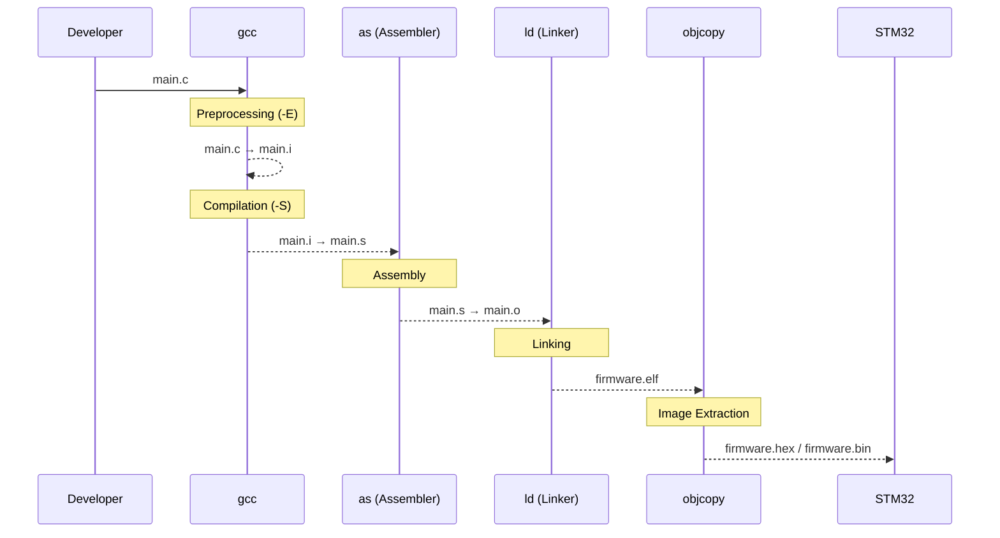

# Ngày 1: Cross-Compilation & GCC ARM Toolchain

## 🎯 Mục tiêu
- Hiểu được khái niệm **Cross-compile** (biên dịch chéo).
- Biết cách sử dụng dòng lệnh thay vì dùng nút bấm đồ họa của IDE.
- Làm quen với cấu trúc `Makefile` cơ bản.

## 📝 Kiến thức cốt lõi
1. **Native Compilation:** Biên dịch code trên PC và chạy luôn trên chip của PC (x86_64).
2. **Cross Compilation:** Biên dịch code trên PC nhưng file đầu ra dùng để chạy dưới vi điều khiển ARM Cortex-M3.
3. 
## 💻 Các câu lệnh đã dùng
Lệnh biên dịch file `main.c` đầu tiên:

 1.Tạo ra file thực thi **ELF**
```bash
+ arm-none-eabi-gcc -c main.c -o main.o (complier&driver)
-> Công cụ giúp biên dịch code C -> hợp ngữ assembly 
+ arm-none-eabi-as (Assembler)
-> Biên dịch file hợp ngữ .s -> file mã nhị phân .o(object file)
+ arm-none-eabi-ld (trình liên kết linker)
-> Gom tất cả các file .o , đọc file linker (.ld) phân vùng ram, flash, 
```
 2.Phân tích file **ELF**
 ```bash
 arm-none-eabi-objdump (Object Dump):
-> Công cụ này cực kỳ bá đạo. Nó có thể "Dịch ngược" (Disassemble) file mã máy .o hoặc .elf của bạn quay trở lại thành file Assembly. Giúp bạn kiểm tra xem code C của mình khi biến thành mã máy thực tế trông như thế nào.

arm-none-eabi-readelf:
-> Giúp bạn đọc cấu trúc chi tiết của file ELF, biết được kích thước của các vùng nhớ như .text (chứa code), .data (chứa biến khởi tạo), .bss (chứa biến chưa khởi tạo) chiếm bao nhiêu byte trên STM32.

arm-none-eabi-nm: 
->Liệt kê danh sách tất cả các Hàm (Functions) và Biến toàn cục (Symbols) có trong chương trình, kèm theo địa chỉ ô nhớ chính xác của chúng trên RAM/Flash.
```
3. Bộ chuyển đổi định dạng (Format converter)
```bash
arm-none-eabi-objcopy: File .elf tạo ra ở trên tuy đầy đủ thông tin nhưng lại chứa cả các dữ liệu dùng để debug (sửa lỗi) nên dung lượng rất nặng và mạch nạp không hiểu được.

 objcopy sẽ nhảy vào bóc tách, vứt hết các thông tin rác thừa thãi đi, chỉ giữ lại mã máy thuần túy để chuyển đổi sang file dạng .bin hoặc .hex. Đây mới là file gọn nhẹ nhất dùng để nạp trực tiếp xuống chip STM32.
``` 

