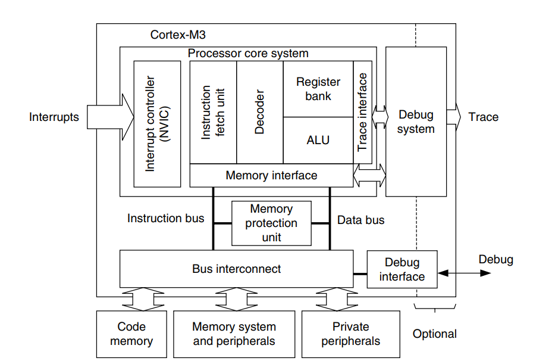
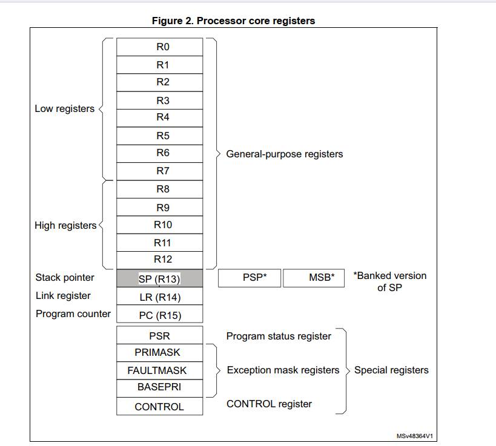
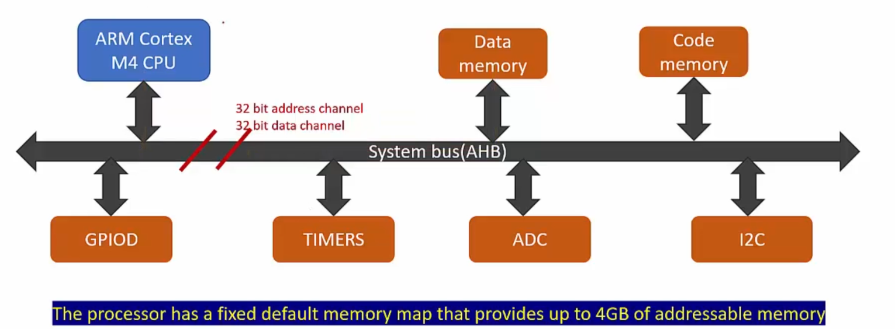

# 📖 Ngày 2 - Bản đồ bộ nhớ (Memory Map) & Memory-Mapped Registers

> **Tài liệu học**
>
> - Chương 05 (Lesson 01 + Lesson 08)
> - Chương 09 (Lesson 01 → Lesson 02)
> - Xem trước bài: 1, 2, 3, 8, 12

---

# 🎯 Mục tiêu bài học

- [ ] Hiểu Memory Map của ARM Cortex-M.
- [ ] Hiểu Address Space 32-bit.
- [ ] Hiểu các vùng nhớ chính (Flash, SRAM, Peripheral...).
- [ ] Hiểu khái niệm Memory-Mapped Registers.
- [ ] Hiểu bản chất vì sao ghi vào một địa chỉ bộ nhớ lại điều khiển được GPIO.
- [ ] Liên hệ với thư viện SPL/HAL.

---

# 1. Memory Map (Bản đồ bộ nhớ) && Non Memory Map

## 1.1 Khái niệm
### Memory Map Registers(Thanh ghi ánh xạ bộ nhớ)
- **Vị trí**: Nằm ở phân khu ngoại vi , các thanh ghi điều khiển GPIO, UART ,SPI, I2C thuộc nhóm này
- **Cách phân vùng** : mỗi thanh ghi có 32 bit nên tổng cộng có 2^32 xấp xỉ 4GB địa chỉ, và các địa chỉ này sẽ phân ra riêng <Flash, RAM, Ngoại vi...>  Ví dụ: 0x4002 0000 của GPIOA
- *(uint32_t*)(0x40020000) = 0x01 tức dùng kỹ thuật con trỏ trong C , khai báo 0x4... là 1 địa chỉ và *(,,,) dùng để ghi trực tiếp vào giá trị địa chỉ đó đang quản lý 
### Non Memory Map Regisrers(Thanh ghi không ánh xạ bộ nhớ)

- **Vị trí**: Nằm trong lõi của bộ xử lý(Register bank) ngay sát vách khối ALU tính toán bao gồm Các thanh ghi đa năng từ <R0 đến R12>, <con trỏ ngăn xếp SP (R13)>, <thanh ghi liên kết LR (R14), con trỏ chương trình PC (R15) và các thanh ghi trạng thái hệ thống như PSR, PRIMASK, CONTROL.>
- **Luật chơi**: Chúng KHÔNG CÓ địa chỉ vật lý trên không gian 4GB CPU coi chúng là các linh kiện phần cứng nội bộ gắn liền với các cổng của ALU để tính toán siêu tốc.
- **Cách truy cập**: Vì không có địa chỉ, ngôn ngữ C hoàn toàn "bất lực", bạn không thể dùng con trỏ để trỏ vào R0 hay PRIMASK. Muốn sờ vào chúng, bạn bắt buộc phải gọi đích danh các câu lệnh Assembly chuyên dụng của lõi ARM:Lệnh <MOV R0, #10>: Ném thẳng số 10 vào thanh ghi R0.Lệnh <MSR PRIMASK, R0>: Ghi giá trị từ R0 vào thanh ghi quản lý ngắt hệ thống PRIMASK.
> Ghi chú: phải dùng các thanh ghi Non khi viết RTOS...

---

## 1.2 Không gian địa chỉ 32-bit

- Khi dữ liệu gửi từ ngoại vi về ví dụ GPIO, sẽ qua đường bus của hệ thống và về core (ở trong đây đã được phân vùng sẵn địa chỉ của ngoại vi),khi core muốn gửi data ngoại vi về vùng `Data memory(RAM)` chỉ cần thông qua bus hệ thống và vùng địa chỉ đã được phân vùng sẵn.
> Ghi chú: 
> + Memory map register: Bắt buộc phải chạy qua hệ thống BUS (I-Code, D-Code, System Bus) để định vị bằng địa chỉ.
> + Non-memory-mapped: Không đi qua đường Bus hệ thống. Dữ liệu di chuyển nội bộ siêu tốc giữa các cổng của ALU.
 
---

## 1.3 Các vùng nhớ chính

### 3. Phân khu CODE

**Địa chỉ**

```text
0x00000000
↓
0x1FFFFFFF
```

#### Chức năng

Đây là nơi chứa **mã chương trình**.

Ví dụ:

- file `.bin`
- file `.elf`
- startup code
- vector table
- các hàm
- dữ liệu `const`

Trên STM32, Flash vật lý thường bắt đầu tại:

```text
0x08000000
```

Sau khi nạp chương trình:

```text
main()

GPIO_Init()

printf()

...
```

đều nằm trong Flash.

CPU sẽ lấy từng lệnh từ đây để thực thi.

👉 Có thể coi đây là **"cuốn sách hướng dẫn"** mà CPU đọc từng dòng.

---

### 4. Phân khu SRAM

**Địa chỉ**

```text
0x20000000
↓
0x3FFFFFFF
```

#### Chức năng

Đây là RAM của vi điều khiển.

Đặc điểm:

- tốc độ rất nhanh
- mất điện sẽ mất dữ liệu

Các dữ liệu nằm trong đây:

- biến toàn cục
- biến cục bộ
- Stack
- Heap
- Buffer

Ví dụ

```c
uint8_t buffer[100];
```

hoặc

```c
int count;
```

Linker sẽ cấp phát địa chỉ trong vùng:

```text
0x20000000
```

👉 Có thể coi đây là **"bàn làm việc"** của CPU.

---

### 5. Phân khu PERIPHERAL

**Địa chỉ**

```text
0x40000000
↓
0x5FFFFFFF
```

Đây là khu vực chứa:

- GPIO
- UART
- SPI
- I2C
- ADC
- Timer
- DMA
- ...

Điều đặc biệt là:

ARM coi **thanh ghi phần cứng cũng là bộ nhớ**.

Ví dụ

```c
GPIOA->ODR = 1;
```

thực chất CPU đang ghi dữ liệu tới một địa chỉ bộ nhớ.

Ví dụ:

```text
0x40020000
```

chính là Base Address của GPIOA.

👉 Có thể coi đây là **"khu công nghiệp điều khiển phần cứng"**.

---

### 6. Tại sao có nhiều vùng Reserved?

STM32 thực tế chỉ có:

Ví dụ

- Flash: 64KB
- RAM: 20KB

Trong khi Address Space lên tới:

```text
4GB
```

Do đó phần lớn địa chỉ sẽ để trống.

ARM để Reserved nhằm:

- mở rộng cho các dòng chip lớn hơn
- giữ nguyên Memory Map
- đảm bảo tương thích giữa các thế hệ chip
## 7.External RAM$1\text{ GB}$
    Tùy chọn XNRAM mở rộng cắm thêm bên ngoài chip nếu thiếu bộ nhớ
## 8.External Device$1\text{ GB}$
    Execute Never (XN)Các thiết bị ngoại vi phần cứng to lớn cắm thêm bên ngoài

 ## 9.System / PPB$512\text{ MB}$Execute Never (XN)
    Thanh ghi hệ thống của riêng lõi ARM: NVIC, SysTick...
---
## 📊 QUẢN LÝ PHÂN VÙNG BỘ NHỚ TRONG LẬP TRÌNH C (EMBEDDED)(ÔN TẬP MEMORY LAYOUT IN C)

### 1. Bộ nhớ FLASH (Vùng CODE) - Mất điện KHÔNG mất dữ liệu
* `.text`: Chứa toàn bộ mã máy của chương trình (các hàm, câu lệnh).
* `.rodata`: Chứa dữ liệu chỉ đọc (Hằng số `const`, chuỗi chữ `"Hello"`).
* Giá trị khởi tạo ban đầu của các biến toàn cục (ví dụ: số `100` của lệnh `int a = 100;`).

### 2. Bộ nhớ SRAM (Vùng RAM) - Mất điện LÀ MẤT dữ liệu
Được chia làm 4 phân khu quản lý biến:
* `.data`: Chứa biến Toàn cục / Biến `static` CÓ khởi tạo giá trị khác 0 (Ví dụ: `int x = 99;`).
* `.bss`: Chứa biến Toàn cục / Biến `static` KHÔNG khởi tạo hoặc khởi tạo bằng 0 (Ví dụ: `int y;`). Hệ thống tự xóa về 0 khi boot.
* `Stack`: Chứa biến Cục bộ nằm trong hàm, tham số của hàm. Sinh ra khi gọi hàm, tự hủy khi thoát hàm.
* `Heap`: Chứa biến cấp phát động qua lệnh `malloc()`. Do kỹ sư tự sinh tự diệt.

> GHi chú: khi cố gắng ghi vào vùng NEver EXECUTE sẽ bị lỗi hardfault ngay lập tức, còn các vùng như flash/code có thể được ghi thông qua đường I-BUS chạy vào đây bốc dữ liệu lên , dịch nó và execute.

> Ghi chú: Memory Map trả lời câu hỏi: Flash ở đâu? SRAM ở đâu? Peripheral ở đâu?Memory Layout trả lời câu hỏi: Bên trong Flash và SRAM, chương trình C được sắp xếp như thế nào?
# 2. Bus Architecture

## 2.1 Khái niệm Bus

> Ghi chú:

---

## 2.2 I-Code Bus

### Chức năng

> Ghi chú:Tuyến đường chuyên dụng nối từ khối Nạp lệnh (Fetch Unit) của CPU đâm thẳng vào Flash để chỉ hút mã lệnh về giải mã.

---

### Đường đi dữ liệu

```text
Flash
 ↓
I-Code Bus
 ↓
CPU
```

---

## 2.3 D-Code Bus

### Chức năng

> Ghi chú:Tuyến đường nối từ khối Quản lý dữ liệu của CPU đâm vào Flash để chỉ bốc dữ liệu hằng số const về phục vụ tính toán.

---

### Đường đi dữ liệu

```text
Flash (Const Data)
 ↓
D-Code Bus
 ↓
CPU
```
> Lý do tối thượng phải nối cả 2 đường vào Flash: > Đề phòng trường hợp "kẹt xe" nội bộ! Nếu trong lúc CPU đang dùng đường I-Code để nạp câu lệnh tiếp theo từ Flash, mà câu lệnh hiện tại lại yêu cầu lôi một hằng số const cũng nằm trong Flash ra để tính toán.
---

## 2.4 System Bus

### Chức năng

> Ghi chú:Tuyến đườg nối Cpu với dữ liệu Ram và ngoại vi như gpio,uart,i2c, spi...

---

### Đường đi dữ liệu

```text
CPU
 ↓
System Bus
 ↓
RAM / Peripheral
```

---

## 2.5 Harvard Architecture

### Vì sao phải tách nhiều Bus?

# Ví dụ CPU thực thi câu lệnh `a = b + 5`

## Bước 1. Biên dịch chương trình

Code C:

```c
a = b + 5;
```

Compiler sẽ dịch thành các lệnh máy (Machine Instructions).

Ví dụ:

```text
LDR
ADD
STR
```

Sau khi Link, các lệnh này được lưu tuần tự trong Flash.

```text
Flash

0x08000000 : LDR
0x08000004 : ADD
0x08000008 : STR
...
```

Mỗi lệnh đều có một địa chỉ riêng trong Flash.

---

## Bước 2. CPU lấy lệnh từ Flash

Khi chương trình chạy, thanh ghi **PC (Program Counter)** chứa địa chỉ của lệnh cần thực thi.

Ví dụ

```text
PC = 0x08000004
```

CPU sẽ gửi địa chỉ này qua **I-Code Bus**.

```text
CPU
 │
 │ 0x08000004
 ▼
I-Code Bus
 │
 ▼
Flash
 │
 ▼
Machine Instruction (ADD)
```

CPU lấy được lệnh máy và thực hiện các bước:

```text
Fetch

↓

Decode

↓

Execute
```

---

## Bước 3. CPU cần dữ liệu

Sau khi giải mã, CPU biết đây là phép cộng.

Ví dụ

```c
a = b + 5;
```

CPU nhận ra phải lấy giá trị của biến **b**.

Lúc này CPU sử dụng **System Bus**.

```text
CPU

↓

System Bus

↓

SRAM

↓

Đọc giá trị của b
```

Sau đó ALU thực hiện:

```text
b + 5
```

Cuối cùng CPU ghi kết quả trở lại SRAM.

```text
CPU

↓

System Bus

↓

SRAM

↓

Ghi vào biến a
```

---

## Nếu chỉ có một Bus (Von Neumann)

CPU phải sử dụng cùng một Bus cho cả:

- đọc lệnh từ Flash
- đọc/ghi dữ liệu trong SRAM

Quá trình sẽ diễn ra tuần tự:

```text
Đọc lệnh từ Flash

↓

Chờ

↓

Đọc dữ liệu từ SRAM

↓

Chờ

↓

Ghi dữ liệu vào SRAM

↓

Đọc lệnh tiếp theo
```

Bus luôn bị tranh chấp, CPU phải chờ liên tục.

Hiện tượng này gọi là **Bus Bottleneck**.

---

## Kiến trúc Harvard của Cortex-M

ARM Cortex-M tách thành nhiều Bus độc lập.

```text
          Flash
            ▲
            │
       I-Code Bus
            │
            ▼
          CPU
            ▲
            │
       System Bus
            │
            ▼
          SRAM
```

Nhờ đó CPU có thể:

- lấy lệnh tiếp theo từ Flash qua **I-Code Bus**
- đồng thời đọc hoặc ghi dữ liệu trong SRAM qua **System Bus**

Hai thao tác không cản trở nhau, giúp tăng hiệu năng xử lý.

---

### Ưu điểm

- [ ]
- [ ]
- [ ]

---


# 3. Tổng kết

## Kiến thức đã học

- [ ]
- [ ]
- [ ]
- [ ]
- [ ]

---

# 📌 Những điều cần ghi nhớ

```text
Memory Map
        ↓
Address Space
        ↓
Peripheral Region
        ↓
Memory-Mapped Register
        ↓
Base Address + Offset
        ↓
Ghi dữ liệu vào Register
        ↓
Điều khiển phần cứng
```

---

---

# 📝 Cheat Sheet

```text
CPU
 │
 │ đọc / ghi
 ▼
Address Bus
 │
 ▼
Memory Map
 │
 ├── Flash
 ├── SRAM
 └── Peripheral
        │
        ▼
Memory-Mapped Registers
        │
        ▼
GPIO
UART
SPI
I2C
ADC
Timer
```