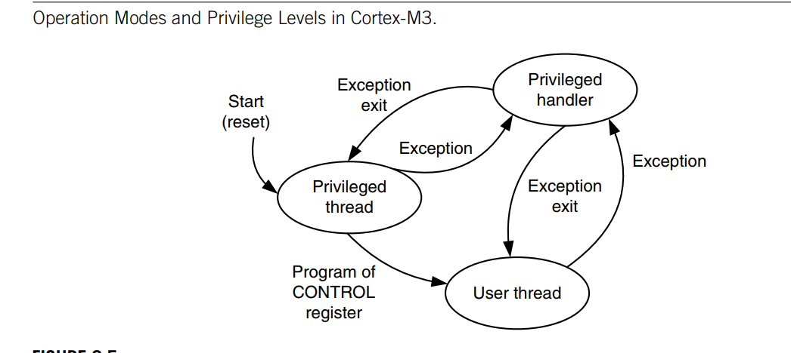
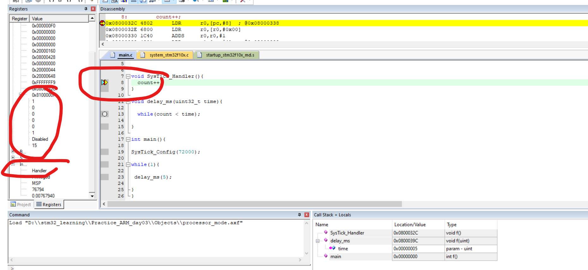

# 📖 Ngày 3 - Chế độ lõi (Processor Modes) & Quyền hạn (Privilege Levels)

> **Tài liệu học**
>
> - Chương 05
> - Lesson 02 → Lesson 04
> - Xem trước bài 4 và bài 13

---

# 🎯 Mục tiêu bài học

Sau bài học cần trả lời được:

- [ ] CPU Cortex-M có bao nhiêu chế độ hoạt động?
- [ ] Thread Mode là gì?
- [ ] Handler Mode là gì?
- [ ] Hai chế độ khác nhau ở điểm nào?
- [ ] CPU chuyển giữa hai chế độ khi nào?
- [ ] Privileged là gì?
- [ ] Unprivileged là gì?
- [ ] Vì sao phải phân quyền?
- [ ] Thanh ghi CONTROL dùng để làm gì?
- [ ] Thread Mode có thể chạy ở quyền nào?
- [ ] Handler Mode luôn chạy ở quyền nào?
- [ ] RTOS sử dụng cơ chế này như thế nào?

---

# 1. Tổng quan

## CPU có những chế độ hoạt động nào?
- Thread Mode và Handler Mode
> Ghi chú:

---

## CPU có những mức quyền nào?
- PAL và NPAL hay còn là privileage và unprivileage
> Ghi chú:

---

## Tại sao ARM phải chia thành Mode và Privilege?

> Ghi chú:

---

# 2. Thread Mode

## Khái niệm
- Là chế độ mặc định khi chip khởi động và các đoạn code thông thường .
> Ghi chú: có thể chạy quyền PAL hoặc NPAL

---

## Khi nào CPU ở Thread Mode?
- Khi khởi động
> Ghi chú:

---

## Những đoạn code nào chạy trong Thread Mode?

- main()
- while(1)
- Hàm người dùng
- ...

---

## Đặc điểm

- Có thể cấu hình sử dụng MSP (Main Stack) hoặc PSP (Process Stack).

---

# 3. Handler Mode

## Khái niệm
- Chỉ xuất hiện khi có sự kiện ngắt ngang , sự kiện khẩn cấp chen ngang(Ngắt uart, ngắt timer, lỗi hệ thống Hardfault).
> Ghi chú: Khi chip ở Mode handlermode thì bắt buộc phải chạy ở Privileage , Khi một ngắt xảy ra (ví dụ: lỗi tràn bộ nhớ), chip nhảy vào HardFault_Handler để xử lý sự cố. Lúc này, đoạn code xử lý ngắt bắt buộc phải có quyền lực tối cao (PAL) thì mới có thể truy cập vào vùng thanh ghi hệ thống PPB (nơi chứa NVIC, SCB) để cấu hình, xóa cờ ngắt hoặc reset lại ch

---

## Khi nào CPU vào Handler Mode?
- Khi có sự kiện ngắt như NVIC, EXTI,systick...
> Ghi chú:

---

## Những thành phần chạy ở Handler Mode

- Interrupt
- Exception
- SysTick
- HardFault
- ...

---
## Đặc điểm:
- Bắt buộc: Chỉ được phép sử dụng duy nhất MSP (Main Stack).
---


# 5. Privileged Level

## Khái niệm

1. Quy luật quyền lực:
   - PAL: Toàn quyền (Đọc/Ghi NVIC, SCB...). Chạy ở cả Thread và Handler.
   - NPAL: Hạn chế (Cấm ghi thanh ghi hệ thống). Chỉ chạy ở Thread.

2. Quy luật chuyển đổi (Thanh ghi CONTROL):
   - PAL -> NPAL: Gõ lệnh Assembly (MRS/MSR) ghi bit CONTROL[0] = 1.
   - NPAL -> PAL: KHÔNG THỂ ghi trực tiếp. Phải kích hoạt Exception (Ngắt/SVC) để phần cứng tự nâng lên PAL trong Handler Mode.

---

# 8. Thanh ghi CONTROL

## Chức năng
**Bit 0 (nPRIV)**: Quyết định mức độ quyền hạn (`Privilege level`) ở Thread Mode.

**0**(Mặc định khi reset): Thread Mode chạy với quyền tối cao PAL (`Privileged`).

**1**: Thread Mode bị tước quyền, hạ xuống thành dân thường NPAL (`Unprivileged`).

Lưu ý: Ở Handler Mode, bit này hoàn toàn bị phần cứng phớt lờ vì Handler Mode luôn luôn là PAL.

Bit **1** (`SPSEL`): Quyết định con trỏ ngăn xếp (Stack Pointer Selection) ở Thread Mode.

**0** (Mặc định khi reset): Dùng MSP (Main Stack Pointer) làm con trỏ ngăn xếp.

**1**: Dùng `PSP` (`Process Stack Pointer`) làm con trỏ ngăn xếp.

Lưu ý: Ở Handler Mode, bit này luôn bằng 0 (ép buộc dùng MSP).
> Ghi chú:

---

## Các bit quan trọng

| Bit | Ý nghĩa |
|------|----------|
| nPRIV |quyền hạn mức độ ưu tiên khi bằng 0 là PAL 1 là NPAL         |
| SPSEL | quyêyts định dùng MSP hay PSP |
>Ghi chú: khi ở handler mode mcu phải chạy quyền tối cao PAL do đó luôn ép buộc dùng MSP
| FPCA (nếu có) | |

## Các lệnh thao tác với thanh ghi CONTROL:
- MSR(Move General Register to Special Register):
+SYNTAX: ```MSR CONTROL, R0``` Ý nghĩa là chuyển giá trị thanh ghi R0 vào thanh ghi hệ thống control
- MRS(Move speical register to general register):
+SYNTAX: ```MRS R0, CONTROL``` Ý nghĩa là chuyển giá trị thanh ghi hệ thống control ra thanh ghi đa dụng R0
---

## Ví dụ:
```c
#include "stm32f10x.h"

// Hàm thực hiện hạ quyền từ PAL xuống NPAL bằng Assembly
void Access_Level_Downgrade(void) {
    __asm volatile (
        "MRS R0, CONTROL \n\t"  // 1. Đọc giá trị thanh ghi CONTROL vào R0
        "ORR R0, R0, #1  \n\t"  // 2. Set bit 0 (nPRIV) lên 1 để chọn NPAL
        "MSR CONTROL, R0 \n\t"  // 3. Ghi ngược giá trị từ R0 vào CONTROL
        "ISB             \n\t"  // 4. Lệnh đồng bộ hệ thống (Instruction Synchronization Barrier)
    );
}

int main(void) {
    // [TRẠNG THÁI 1]: Vừa khởi động -> Đang ở Thread Mode + PAL (Quyền tối cao)
    // Dòng này cấu hình NVIC vẫn thành công rực rỡ vì đang có quyền PAL
    NVIC->ISER[0] |= (1 << 15); 

    // [BƯỚC NGOẶT]: Gọi hàm ép chip hạ quyền xuống dân thường (NPAL)
    Access_Level_Downgrade();

    // [TRẠNG THÁI 2]: Bây giờ chip đã ở Thread Mode + NPAL (User Mode)
    // Hãy thử cố tình ghi lại vào thanh ghi NVIC một lần nữa xem sao!
    NVIC->ISER[0] |= (1 << 15); 

    while(1) {
        __NOP();
    }
}
```
### GIẢI THÍCH:
1. Chip vừa bật: Quyền PAL -> Được phép ghi vào thanh ghi hệ thống (NVIC).
2. Chạy lệnh Assembly (MRS/MSR): Sửa bit nPRIV của thanh ghi CONTROL lên 1 -> Biến thành quyền NPAL.
3. Sau khi hạ quyền NPAL: Nếu cố tình ghi vào thanh ghi hệ thống một lần nữa -> Phần cứng CPU phát hiện vi phạm và đá văng vào HardFault (Treo chip bảo mật).
> Ghi chú:Khi ở quyền NPAL thì vẫn có thể dùng lệnh MRS để đọc thanh ghi control nhưng nếu dùng MSR để sửa bit 0 (nPRIV) lên 0 -> CPU phớt lờ lệnh này (đã giải thích rõ ở mục trên quy tắc chuyển quyền).

---


## Sơ đồ

```text
Reset
   │
   ▼
Thread Mode
   │
Interrupt
   ▼
Handler Mode
   │
ISR kết thúc
   ▼
Thread Mode
```

---


# 11. Liên hệ với STM32

Ví dụ

```c
#include "stm32f10x.h"                  // Device header
volatile uint32_t count = 0;
void SysTick_Handler(){
	count++;
}
void delay_ms(uint32_t time){
	while(count < time);
}

int main(){
SysTick_Config(72000);
	while(1){
		delay_ms(5);
	}
}
```

Đang chạy ở chế độ Handler và thannh ghi ISR là 15 tương ứng với SYSTICk

> Ghi chú:

---


# 12. Liên hệ với RTOS

## Vì sao RTOS cần Privilege?

> Ghi chú:

---

## User Task chạy ở đâu?

> Ghi chú:

---

## Kernel chạy ở đâu?

> Ghi chú:

---

# 13. Luồng hoạt động tổng thể

```text
                Reset
                   │
                   ▼
        Thread Mode (Privileged)
                   │
             main()
                   │
          while(1)
                   │
        Có Interrupt?
             │
       Không │ Có
             │
             ▼
        Handler Mode
             │
      Thực hiện ISR
             │
             ▼
     Return from Exception
             │
             ▼
         Thread Mode
```

---

# 📝 Cheat Sheet

```text
CPU Mode

├── Thread Mode
│     ├── main()
│     ├── while()
│     └── User Code
│
└── Handler Mode
      ├── Interrupt
      ├── Exception
      └── SysTick

------------------------------------

Privilege

├── Privileged
│     ├── Full Access
│     └── System Control
│
└── Unprivileged
      ├── Limited Access
      └── Không được phép truy cập một số tài nguyên hệ thống
```

---

# ❓ Câu hỏi cần tự trả lời sau bài học

## Về Mode

- CPU có bao nhiêu chế độ hoạt động?
- Thread Mode dùng để làm gì?
- Handler Mode dùng để làm gì?
- Khi nào CPU chuyển sang Handler Mode?
- CPU quay lại Thread Mode bằng cách nào?

---

## Về Privilege

- Privileged là gì?
- Unprivileged là gì?
- Tại sao phải phân quyền?
- Thread Mode có thể chạy ở quyền nào?
- Handler Mode có thể chạy ở quyền nào?
- Vì sao Handler luôn có quyền cao hơn?

---

## Về CONTROL Register

- CONTROL Register dùng để làm gì?
- Bit nPRIV có ý nghĩa gì?
- Bit SPSEL có ý nghĩa gì?

---

## Về ứng dụng

- main() chạy ở Mode nào?
- Interrupt chạy ở Mode nào?
- SysTick chạy ở Mode nào?
- RTOS sử dụng Thread Mode và Handler Mode như thế nào?
- Nếu một Task chạy ở Unprivileged thì bị hạn chế những gì?

---

# 📌 Kết luận sau bài học

> Viết lại bằng lời của chính mình:

....................................................................

....................................................................

....................................................................

....................................................................