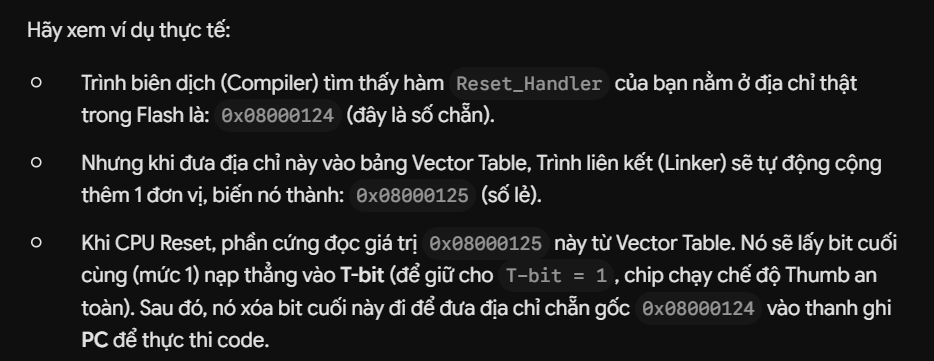
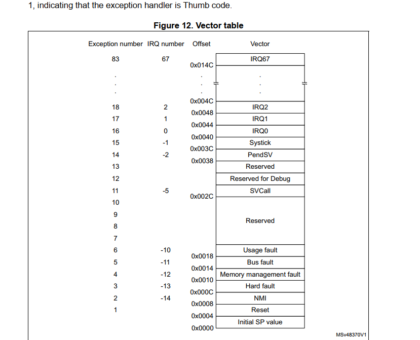

# 📅 Ngày 7 - Quy trình Khởi động (Reset Sequence)

---

# 🎯 Mục tiêu chương

> Hiểu toàn bộ quá trình CPU ARM Cortex-M khởi động sau khi Reset.

Sau chương này mình cần có thể:

- [ ] Hiểu Reset Sequence là gì
- [ ] Biết CPU thực hiện điều gì đầu tiên sau Reset
- [ ] Hiểu Vector Table là gì
- [ ] Biết CPU lấy MSP ở đâu
- [ ] Biết CPU lấy Reset Handler ở đâu
- [ ] Hiểu vai trò của Startup Code

---

# 1. Reset Sequence là gì?

## Định nghĩa
- Là quá trình CPU thực hiện các bước khởi động ngay sau khi nhất nút reset -> đưa hệ thống sẵn sáng chạy chương trình
> ...

---

## Khi nào Reset xảy ra?

Ví dụ:

- Power On Reset
- Nhấn nút Reset
- Watchdog Reset
- Software Reset

---

# 2. CPU làm gì đầu tiên sau Reset?

Thứ tự thực hiện:

# 🔄 ARM Cortex-M Reset Sequence

```c
                RESET
                  │
                  ▼
      CPU bắt đầu truy cập địa chỉ
            0x00000000
                  │
                  ▼
      (Memory Remap của STM32)
                  │
                  ▼
      0x00000000  ─────────► 0x08000000 (Flash)
                  │
                  ▼
      Đọc dữ liệu tại 0x08000000
                  │
                  ▼
      Giá trị đọc được:
           0x20002000
     (Initial Main Stack Pointer)
                  │
                  ▼
      CPU nạp giá trị này vào
                MSP
                  │
                  ▼
      CPU tiếp tục đọc địa chỉ
            0x00000004
                  │
                  ▼
      (Memory Remap của STM32)
                  │
                  ▼
      0x00000004 ─────────► 0x08000004 (Flash)
                  │
                  ▼
      Đọc dữ liệu tại 0x08000004
                  │
                  ▼
      Giá trị đọc được:
      Địa chỉ Reset_Handler
      (Ví dụ: 0x080001A9)
                  │
                  ▼
      CPU nạp địa chỉ này vào
                 PC
                  │
                  ▼
      Bắt đầu thực thi
          Reset_Handler
                  │
                  ▼
         Startup Code (.s)
                  │
                  ├── Khởi tạo .data
                  ├── Xóa .bss
                  ├── SystemInit()
                  ├── __libc_init_array()
                  ▼
                main()
```

---

## 📌 Những điều cần nhớ

- `0x00000000` **không chứa trực tiếp Startup Code**, mà chứa **giá trị Initial MSP**.
- `0x00000004` **không chứa mã lệnh**, mà chứa **địa chỉ của hàm `Reset_Handler`**.
- CPU **không chạy từ `0x00000000`**, mà chỉ **đọc dữ liệu** tại đó.
- Sau khi nạp:
  - `MSP ← Initial MSP`
  - `PC ← Reset_Handler`
- Từ thời điểm đó, CPU bắt đầu thực thi Startup Code.

---

# 3. Vector Table
## Định nghĩa:
- Bảng chứa các "Địa chỉ tuyệt đối" (Absolute Addresses) của các hàm xử lý ngắt (Exception/Interrupt Handlers).Để ép CPU tự động đặt T-bit = 1 ngay khi vừa nhảy vào hàm ngắt, kiến trúc ARM quy định một luật bất di bất dịch: Tất cả các địa chỉ hàm xử lý ngắt được ghi vào Vector Table bắt buộc phải là SỐ LẺ (tức là bit cuối cùng LSB của địa chỉ phải bằng 1).

> Ví dụ: Nếu hàm Reset_Handler nằm ở địa chỉ 0x08000124, thì tại ô nhớ 0x08000004 trong Vector Table sẽ ghi đúng giá trị số 0x08000124. Khi ngắt xảy ra, CPU chỉ việc nhảy thẳng đến địa chỉ đó.

> Giải thích về chế độ THUMB 16bit(T bit)

---

## Chứa những gì?


---


# 5. Startup Code

Startup Code thường làm:

- Khởi tạo Stack
- Copy .data từ Flash → RAM
- Clear .bss
- Khởi tạo System Clock
- Gọi SystemInit()
- Gọi main()
```bash
[BẤM NÚT RESET / CẤP NGUỒN]
       │
       ▼
1. PHẦN CỨNG TỰ ĐỘNG: 
   - Đọc ô 0x08000000 để nạp đỉnh STACK vào thanh ghi SP.
   - Đọc ô 0x08000004 để nạp địa chỉ hàm Reset_Handler vào PC.
       │
       ▼
2. CODE ASSEMBLY TRONG RESET_HANDLER (FILE STARTUP):
   - Gọi hàm SystemInit() --> Để khởi tạo System Clock (Xung nhịp hệ thống).
       │
       ▼
3. PHÂN VÙNG BỘ NHỚ TRÊN RAM (FILE STARTUP TỰ VIẾT HOẶC THƯ VIỆN __main ĐẢM NHẬN):
   - Chạy vòng lặp Copy toàn bộ phân vùng `.data` từ FLASH vào RAM.
   - Chạy vòng lặp xóa sạch (ghi số 0) vào toàn bộ phân vùng `.bss` trên RAM.
       │
       ▼
4. BƯỚC CUỐI CÙNG:
   - Gọi lệnh nhảy (BL main) để chính thức thực thi code C của người dùng.
```

### Tổng kết về file startup:
- File Startup xin 1KB RAM làm Stack $\rightarrow$ .
- File Startup xếp các hàm ngắt cách nhau 4 bytes trên Flash $\rightarrow$ .
- Khi có ngắt, CPU bỏ main() nhảy vào hàm ngắt $\rightarrow$ .
- Nếu hàm ngắt trống rỗng (chỉ có lệnh B . mặc định của hãng), chip sẽ bị treo vòng lặp vô hạn (đứng hình) chứ không dính lỗi HardFault.
---

# 6. Luồng khởi động

```

Cấp nguồn

↓

Reset

↓

CPU đọc MSP

↓

CPU đọc Reset Handler

↓

Startup Code

↓

SystemInit()

↓

main()

↓

while(1)

```

---

# 7. Liên hệ với chương trước

Sau Reset:

- CPU dùng MSP
- Thread Mode
- Privileged
- CONTROL mặc định = 0

---

# 9. Những thành phần liên quan

| Thành phần | Vai trò |
|------------|----------|
| Flash | Chứa chương trình |
| Vector Table | Bảng địa chỉ Exception |
| MSP | Stack đầu tiên |
| Reset Handler | Điểm bắt đầu chương trình |
| Startup Code | Khởi tạo hệ thống |
| main() | Chương trình người dùng |

---

# 10. Ứng dụng thực tế

Reset Sequence được sử dụng trong:

- Bootloader
- Linker Script
- Startup File
- RTOS
- Embedded Linux Boot
- Firmware Update

---

# 11. Những điều cần nhớ

✅ CPU không chạy ngay vào main()

✅ CPU luôn đọc MSP trước.

✅ CPU luôn đọc Reset Handler sau.

✅ Vector Table nằm ở đầu Flash (mặc định).

✅ Startup Code chạy trước main().

---

# 12. Tổng kết chương

## Đã hiểu

- [ ]

- [ ]

- [ ]

---

## Chưa rõ

- [chi tiết chế độ thumb 2 ]

- [cụ thể các câu lệnh thực tế bên trong file startup ]

---

# 💡 Ghi chú của bản thân

...