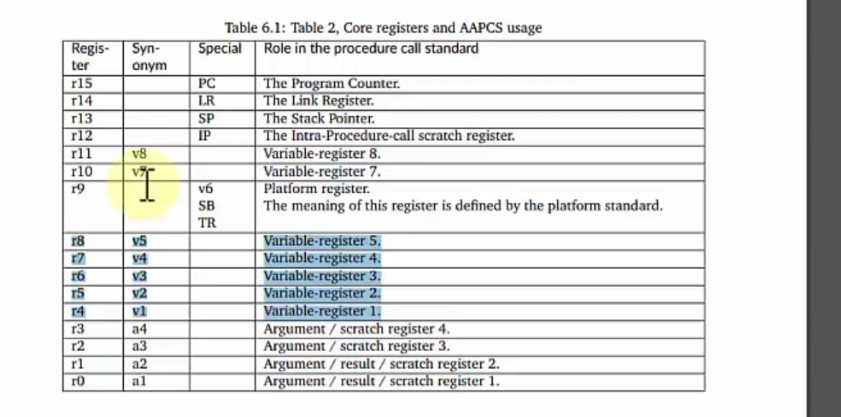

# 📚 Ngày 10 - Chương 10 (Lesson 05-07)
# Thực hành Stack & Chuẩn AAPCS

## 🎯 Mục tiêu bài học

Hiểu cách ARM Cortex-M quản lý lời gọi hàm (Function Call) theo chuẩn AAPCS (ARM Procedure Call Standard).

Sau bài học cần trả lời được:

- AAPCS là gì?
- Tại sao ARM cần chuẩn gọi hàm?
- Vì sao 4 tham số đầu truyền qua R0-R3?
- Tham số thứ 5 trở đi được lưu ở đâu?
- Giá trị trả về được đặt ở thanh ghi nào?
- Khi nào Compiler PUSH dữ liệu lên Stack?
- Hàm gọi (Caller) và hàm được gọi (Callee) chịu trách nhiệm lưu thanh ghi nào?
- LR hoạt động như thế nào khi gọi hàm?
- BL và BX LR hoạt động ra sao?
- Stack Frame của một hàm gồm những gì?

---

# 📖 Kiến thức trọng tâm

## 1. AAPCS (ARM Procedure Call Standard)

### Khái niệm:
- AAPCS là một bộ quy chuẩn cấu trúc (Calling Convention) do ARM thiết lập, quy định một cách nghiêm ngặt cách các hàm (procedures/functions) phân chia nhiệm vụ sử dụng tập thanh ghi (R0 - R15) và bộ nhớ Stack khi giao tiếp với nhau.

### Mục đích
- **Tối ưu hoá hệ thống**:Ưu tiên truyền 4 tham số làm việc với các thanh ghi r0-r3 tránh cpu phải ra vào đọc stack liên tục
- **Quản lý tài nguyên**: Phân định rõ thanh ghi nào là nháp (Caller-saved R0-R3) thanh ghi nào là hàm bảo toàn (Callee saved R4-R11)nhằm giảm thiểu số lượng lệnh PUSH/POP không cần thiết, đặc biệt là khi hệ thống phải phản ứng khẩn cấp với các sự kiện Ngắt (Interrupt).


### Vai trò
- **Nền tảng để tối ưu hóa Ngắt bằng phần cứng:** Tạo ra một cấu trúc Stack Frame vuông vắn (đồng bộ hóa căn lề 8-byte), giúp phần cứng của chip ARM Cortex-M có thể tự động thực hiện việc cất cứu hộ dữ liệu (Auto-stacking) ngay khi dính ngắt, cho phép các lập trình viên viết hàm ngắt hoàn toàn bằng ngôn ngữ C thông thường.
Ghi chú:

---

## 2. Quy tắc truyền tham số

### R0
- Lưu giá trị tham số thứ nhất
- Ngoài ra còn lưu giá trị hàm trả về sau khi tính toán xong

### R1
- Lưu giá trị tham số thứ 2

### R2
- Lưu giá trị tham số thứ 3

### R3
- Lưu giá trị tham số thứ 4

### Tham số thứ 5
- Push vào stack 

### Tham số thứ 6
- Push vào stack 

> Ghi chú:**Thứ tự PUSH vào Stack**: Theo luật AAPCS, trình biên dịch sẽ thực hiện lệnh PUSH các tham số dư thừa theo thứ tự từ phải qua trái. Nghĩa là biến f (tham số 6) sẽ được đẩy vào Stack trước, sau đó mới đến biến e (tham số 5). Do đó, tham số thứ 5 (e) sẽ nằm ở địa chỉ thấp hơn và gần với đỉnh con trỏ SP hơn, giúp hàm con dễ dàng truy cập trước.

Ví dụ:

```c
sum(a,b,c,d,e,f);
```
```bash
; Step 1: Chuẩn bị các tham số thừa đẩy vào Stack (Từ phải qua trái)
MOV R4, #val_f          ; Nạp giá trị của f vào một thanh ghi tạm R4
PUSH {R4}               ; PUSH giá trị f vào Stack (Tham số thứ 6)

MOV R4, #val_e          ; Nạp giá trị của e vào thanh ghi tạm R4
PUSH {R4}               ; PUSH giá trị e vào Stack (Tham số thứ 5)

; Step 2: Nạp 4 tham số đầu tiên vào các thanh ghi lõi siêu tốc
MOV R0, #val_a          ; R0 = a (Tham số thứ 1)
MOV R1, #val_b          ; R1 = b (Tham số thứ 2)
MOV R2, #val_c          ; R2 = c (Tham số thứ 3)
MOV R3, #val_d          ; R3 = d (Tham số thứ 4)

; Step 3: Gọi hàm sum
BL sum                  ; Nhảy đến hàm sum (Branch with Link)
```

---
> 

## 3. Giá trị trả về

### Hàm trả về int
- Quy tắc: Giá trị trả về bắt buộc phải được nạp vào thanh ghi R0 trước khi thoát hàm.Ví dụ: int kết_quả = sum(a, b); $\rightarrow$ Hàm sum tính xong sẽ nhét kết quả vào thanh ghi R0. Khi quay về hàm cha, hàm cha cứ việc chạy ra bốc dữ liệu từ R0 ra dùng.

### Hàm trả về pointer
- Quy tắc: Bản chất con trỏ là một địa chỉ 32-bit, do đó nó được đối xử giống hệt như kiểu int. Giá trị địa chỉ đó bắt buộc phải lưu trong thanh ghi R0.Ví dụ: uint32_t* ptr = get_buffer_address(); $\rightarrow$ Hàm get_buffer_address sẽ nạp địa chỉ của vùng đệm vào R0 rồi quay về.

### Hàm trả về struct
- Trường hợp Struct nhỏ ($\le$ 32-bit hoặc $\le$ 64-bit):Nếu struct chỉ nặng tối đa 4 bytes (ví dụ chứa 1 biến int hoặc 2 biến short), kết quả trả về sẽ được nén gọn gàng và nhét vào thanh ghi R0.Nếu struct nặng từ 5 đến 8 bytes, kết quả sẽ được chia đôi và nạp vào cặp thanh ghi song sinh là R0 (lưu 4 bytes thấp) và R1 (lưu 4 bytes cao).
- Trường hợp Struct lớn ($> 64$-bit hoặc $> 8$ Bytes - Ý cốt lõi quan trọng):Do các thanh ghi lõi không đủ sức chứa một khối struct quá lớn, AAPCS ép Compiler phải dùng RAM (Stack) làm trung gian.Cách thức vận hành ngầm: Trước khi gọi hàm, hàm cha sẽ dọn sẵn một khoảng trống dưới Stack để chuẩn bị hứng cái struct này. Địa chỉ của khoảng trống đó được nạp vào thanh ghi R0. Khi vào trong hàm con, hàm con tính toán xong sẽ ghi trực tiếp dữ liệu struct vào cái địa chỉ RAM mà R0 đang chỉ tới.

Ghi chú:

---

## 4. Thanh ghi LR

### BL
- Lệnh BL là công cụ chính mã máy dùng để gọi một hàm C. Khi CPU thực thi lệnh BL <địa_chỉ_hàm>, phần cứng sẽ làm ĐỒNG THỜI 2 việc chỉ trong một chu kỳ máy:

- Link (Tạo liên kết): Tự động bốc địa chỉ của dòng lệnh ngay phía dưới lệnh BL (tức là lệnh tiếp theo ở main) nạp vào thanh ghi LR.

- Branch (Rẽ nhánh): Nạp địa chỉ của hàm cần gọi vào thanh ghi PC để ép CPU nhảy sang hàm đó thực thi.

### LR lưu gì?
Khi gọi hàm thông thường: LR lưu địa chỉ tuyệt đối của câu lệnh tiếp theo thuộc hàm cha (main) ngay sau khi lệnh BL kết thúc. Địa chỉ này gọi là Return Address.

> Khi xảy ra Ngắt (Interrupt/Exception): LR không lưu địa chỉ code nữa, mà phần cứng sẽ tự động nạp vào một mã đặc biệt gọi là EXC_RETURN (ví dụ: 0xFFFFFFFD). Mã này đóng vai trò làm tín hiệu để CPU biết lúc thoát ngắt phải trả về chế độ nào, dùng Stack MSP hay PSP.

### BX LR
- Cơ chế: Lệnh này thực hiện phép toán: Nạp giá trị đang được cất giữ trong thanh ghi LR vào lại thanh ghi PC.

- Hệ quả: Vì PC bị cưỡng ép nhận lại địa chỉ cũ ở main, CPU lập tức rẽ nhánh bay ngược trở lại dòng code đang dang dở của main để chạy tiếp. Chữ Exchange (Trao đổi) ở đây còn có ý nghĩa là kiểm tra bit cuối cùng của địa chỉ để ép CPU chạy ở chế độ Thumb State (luôn luôn bằng 1 đối với Cortex-M).

### Return Address

Ghi chú:

---

## 5. Stack Frame

Một Function Call lưu:

- Return Address
- Local Variables
- Saved Registers
- Function Arguments (nếu cần)

Vẽ sơ đồ:


---

## 6. Caller Saved Register

Thanh ghi nào?

- R0
- R1
- R2
- R3
- R12

Compiler xử lý ra sao?

---

## 7. Callee Saved Register

Thanh ghi nào?

- R4-R11

Compiler PUSH khi nào?

Compiler POP khi nào?

---

## 8. PUSH / POP trong lời gọi hàm

Ví dụ Assembly

```asm

```

SP thay đổi như thế nào?

---

## 9. Compiler tạo Assembly

Ví dụ:

```c
int sum(int a,int b)
{
    return a+b;
}
```

Assembly:

```asm

```

Giải thích từng dòng.

---

## 10. Liên hệ với Stack

Stack dùng để lưu:

- Local Variable
- Return Address
- Saved Register

Liên hệ ngày 09.

---

## 11. Liên hệ với RTOS

Context Switch cần lưu:

- R4-R11
- LR
- PSP

AAPCS giúp RTOS biết phải lưu thanh ghi nào.

---

# 🧠 Sau bài học phải trả lời được

## Câu 1

AAPCS là gì?

---

## Câu 2

Tại sao ARM chỉ truyền 4 tham số đầu qua Register?

---

## Câu 3

Nếu hàm có 8 tham số thì các tham số được truyền như thế nào?

---

## Câu 4

Giá trị trả về nằm ở đâu?

---

## Câu 5

BL làm gì?

BX LR làm gì?

---

## Câu 6

LR khác PC như thế nào?

---

## Câu 7

Caller Saved và Callee Saved khác nhau ở điểm nào?

---

## Câu 8

Compiler quyết định PUSH thanh ghi nào?

---

## Câu 9

Stack Frame gồm những thành phần nào?

---

## Câu 10

Nếu quên POP hoặc Stack bị lệch điều gì xảy ra?

---

# 🔗 Liên hệ các chương trước

## Chương 05

- R0-R15
- LR
- PC
- SP

---

## Chương 06

- Assembly
- BL
- BX
- PUSH
- POP

---

## Chương 09

- MSP
- PSP
- Stack
- Stack Frame

---

# 🚀 Liên hệ các chương sau

## Startup Code

Reset_Handler gọi:

```asm
BL SystemInit
BL main
```

Tại sao BL hoạt động được?

---

## Linker Script

Stack được cấp bao nhiêu byte?

Stack Overflow xảy ra khi nào?

---

## Exception

Exception Entry PUSH:

- R0-R3
- R12
- LR
- PC
- xPSR

Liên hệ với Stack Frame.

---

## RTOS

Task Switch:

Lưu:

- R4-R11

Khôi phục:

- R4-R11

AAPCS quy định điều này.

---

## Bootloader

Bootloader nhảy sang Application bằng:

```asm
MSR MSP,...
BX ...
```

Hiểu LR và PC sẽ hiểu cách Bootloader chuyển quyền điều khiển.

---

## Embedded Linux

AAPCS vẫn được dùng trong:

- GCC ARM
- Linux Kernel
- Driver
- Bare-metal

---

# 💡 Tổng kết

> AAPCS là chuẩn quy định cách các hàm trên ARM Cortex-M trao đổi dữ liệu.

Compiler tuân theo chuẩn này để:

- Truyền tham số.
- Trả về giá trị.
- Bảo vệ thanh ghi.
- Quản lý Stack.

Nhờ đó mọi object file và thư viện có thể làm việc với nhau mà không cần biết chúng được biên dịch ở đâu.

---

# ⭐ Từ khóa

- AAPCS
- Procedure Call
- Function Call
- R0-R3
- Return Value
- Caller Saved
- Callee Saved
- LR
- PC
- BL
- BX LR
- PUSH
- POP
- Stack Frame
- ABI